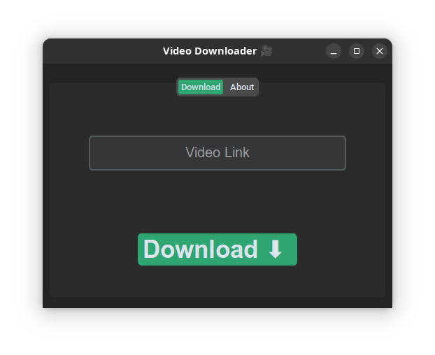
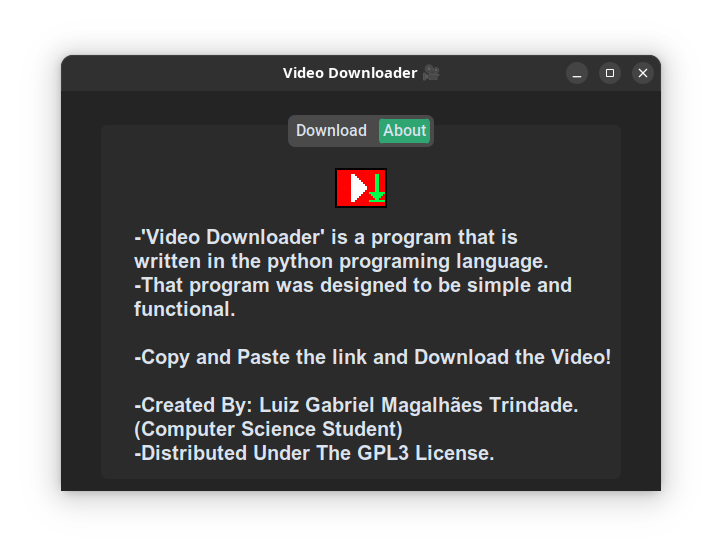
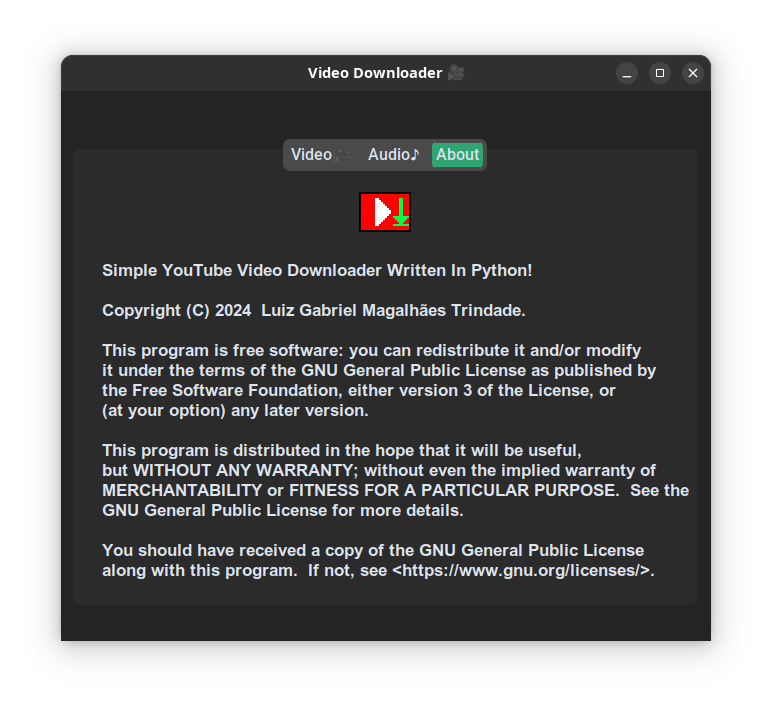

<div align="center">
  
  <h1>YouTube Video Downloader</h1>
  <p><strong>Baixe vídeos e playlists do YouTube com alta velocidade e paralelismo</strong></p>

  <!-- Badges -->
  
  
  
  
  
  
</div>

## 📋 Visão Geral

Um **download de vídeos/áudios do YouTube** com interface gráfica moderna (CustomTkinter), que suporta:

- ✅ Download de **vídeos individuais** (qualidade máxima)
- ✅ Download de **playlists completas** (detecção automática)
- ✅ **Paralelismo real** (multiprocessing) para baixar vários vídeos da playlist simultaneamente
- ✅ Download apenas de **áudio** (formato MP3)
- ✅ Interface com abas separadas para vídeo e áudio
- ✅ Notificações visuais e sonoras (opcional)
- ✅ Fallback inteligente: se a playlist falhar, tenta baixar como vídeo único

> Desenvolvido sob a licença **GPLv3** – software livre para toda a comunidade.

## 🚀 Demonstração

| Aba Vídeo | Aba Áudio | Sobre |
|-----------|-----------|-------|
|  |  |  |

## 📦 Instalação

### Pré‑requisitos
- Python 3.13 ou superior
- `pip` e `venv` (recomendado)

### Passos

1. **Clone o repositório**
   ```bash
   git clone https://github.com/luizmagalhaes/video-downloader.git
   cd video-downloader
   ```

2. **Crie um ambiente virtual** (opcional, mas recomendado)
   ```bash
   python -m venv .venv
   source .venv/bin/activate   # Linux/macOS
   # ou .venv\Scripts\activate   # Windows
   ```

3. **Instale as dependências**
   ```bash
   pip install customtkinter yt-dlp pygame Pillow
   ```

4. **Execute o programa**
   ```bash
   python video_downloader.py
   ```

### Estrutura de arquivos (opcional)
O programa espera (opcionalmente) os seguintes recursos:
```
_internal/
├── icons/
│   └── icon.png         # Ícone da janela (64x64)
└── sound/
    └── alert_sound.mp3  # Som de notificação
screenshots/             # Capturas de tela (para o README)
```

Caso os arquivos não existam, o programa funciona normalmente (apenas sem ícone/som).

## 🎮 Como usar

1. **Copie o link** do vídeo ou playlist do YouTube.
2. Selecione a aba **Video🎥** (para MP4) ou **Audio🎵** (para MP3).
3. Cole o link no campo de entrada.
4. Clique em **Download ⬇️**.
5. Escolha a pasta de destino.
6. Aguarde a conclusão – uma notificação será exibida.

> **Playlists**: O programa detecta automaticamente se o link é de uma playlist. Cada vídeo da playlist será baixado em **processos paralelos** (um por núcleo da CPU), acelerando muito o processo. Caso a detecção falhe, ele tenta baixar como vídeo único (fallback).

## ⚙️ Funcionamento técnico

| Componente             | Descrição                                                                 		|
|------------------------|----------------------------------------------------------------------------------|
| `yt-dlp`               | Extrai informações e realiza o download (suporte a YouTube e outras plataformas) |
| `customtkinter`        | Interface gráfica moderna com abas e temas                                		|
| `multiprocessing.Pool` | Paraleliza o download de playlists – cada vídeo roda em um processo separado 	|
| `pygame.mixer`         | Toca um som de alerta ao final do download (opcional)                     		|
| `Pillow` (PIL)         | Carrega imagens para `CTkImage`, corrigindo problemas de escala em telas HiDPI 	|

### Lógica de detecção de playlist
1. O programa chama `yt-dlp` com `extract_flat=True` para verificar o tipo da URL.
2. Se `_type == 'playlist'`, extrai a lista de URLs individuais.
3. Tenta baixar em paralelo; se algo falhar, usa o fallback de vídeo único.

## 🧪 Testado em

- 🐧 Linux (Ubuntu 22.04/24.04)
- 🪟 Windows 10/11
- 🍎 macOS (via Python nativo)

## 🤝 Contribuindo

Contribuições são bem‑vindas! Siga os passos:

1. Faça um fork do projeto.
2. Crie uma branch para sua feature (`git checkout -b feature/nova-feature`).
3. Commit suas mudanças (`git commit -m 'Adiciona nova feature'`).
4. Push para a branch (`git push origin feature/nova-feature`).
5. Abra um **Pull Request**.

Por favor, certifique‑se de que seu código mantém a compatibilidade com GPLv3.

## 📄 Licença

Distribuído sob a licença **GNU General Public License v3.0**.  
Veja o arquivo [LICENSE](LICENSE) ou clique no banner abaixo:

<p align="center">
  <a href="https://www.gnu.org/licenses/gpl-3.0.en.html">
    
  </a>
</p>

---

<p align="center">
  Feito com ❤️ por <a href="https://github.com/luizmagalhaes">Luiz Gabriel Magalhães Trindade</a>
</p>
